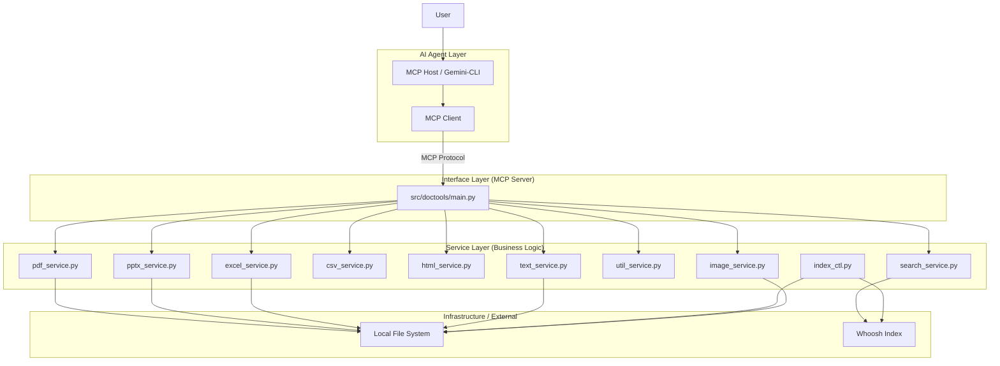
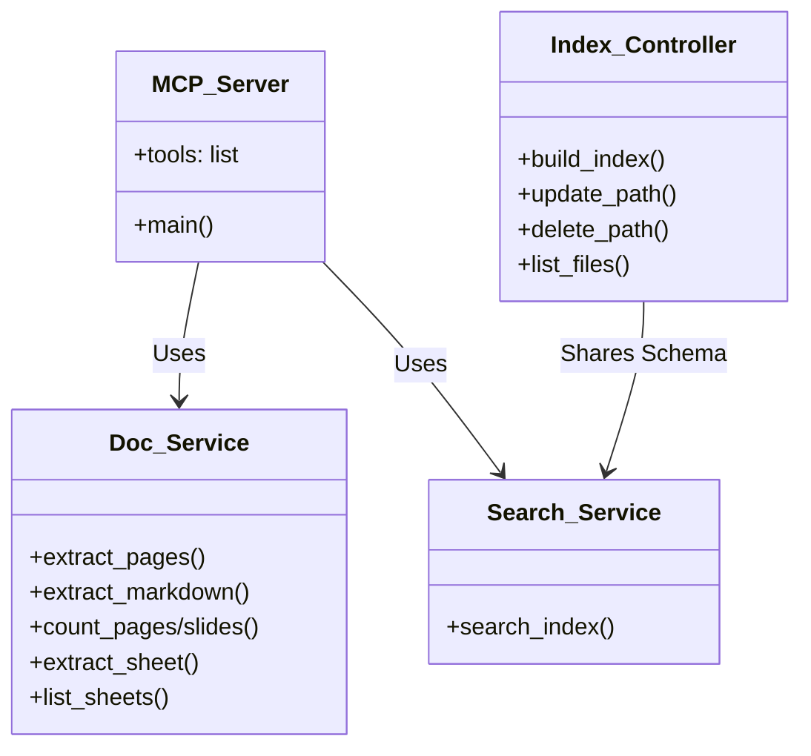

# MCP Tools 設計書

## 目次

- [機能一覧](#機能一覧)
- [機能詳細](#機能詳細)
    - [機能カテゴリ: PDF操作 (PDF)](#機能カテゴリ-pdf操作-pdf)
    - [機能カテゴリ: PowerPoint操作 (PPTX)](#機能カテゴリ-powerpoint操作-pptx)
    - [機能カテゴリ: Excel操作 (XLSX)](#機能カテゴリ-excel操作-xlsx)
    - [機能カテゴリ: CSV操作 (CSV)](#機能カテゴリ-csv操作-csv)
    - [機能カテゴリ: HTML操作 (HTML)](#機能カテゴリ-html操作-html)
    - [機能カテゴリ: 画像操作 (IMAGE)](#機能カテゴリ-画像操作-image)
    - [機能カテゴリ: 共通ユーティリティ (UTIL)](#機能カテゴリ-共通ユーティリティ-util)
    - [機能カテゴリ: 検索・インデックス (SEARCH)](#機能カテゴリ-検索・インデックス-search)

- [アーキテクチャ](#アーキテクチャ)
    - [設計方針](#設計方針)
    - [全体構成図](#全体構成図)
- [インターフェース](#インターフェース)
    - [1. doctools-mcp (ドキュメント操作系)](#1-doctools-mcp-ドキュメント操作系)
        - [ツール一覧](#ツール一覧)
        - [共通設計](#共通設計)
        - [個別インターフェース設計](#個別インターフェース設計)
    - [2. CLI (Index Controller)](#2-cli-index-controller)
        - [コマンド一覧](#コマンド一覧-1)
        - [共通設計](#共通設計-1)
        - [個別インターフェース設計](#個別インターフェース設計-1)
- [コンポーネント](#コンポーネント)
    - [コンポーネント概要 (High-Level Overview)](#コンポーネント概要-high-level-overview)
    - [コンポーネント詳細](#コンポーネント詳細)
        - [1. Document Components](#1-document-components)
- [データモデル](#データモデル)
    - [検索インデックス (Whoosh)](#検索インデックス-whoosh)
- [エラーハンドリング](#エラーハンドリング)

## 機能一覧

| 機能カテゴリ | 機能ID | 機能名 | 概要 | 対応要件ID |
|:---|:---|:---|:---|:---|
| PDF操作 | PDF-F01 | pdf_extract_pages | PDF ページ切り出しとファイル保存 | PDF-01 |
| PDF操作 | PDF-F02 | pdf_extract_markdown | PDF テキスト抽出と Markdown 保存 | PDF-02 |
| PDF操作 | PDF-F03 | pdf_count_pages | PDF 総ページ数取得 | PDF-03 |
| PDF操作 | PDF-F04 | pdf_extract_images | 指定ページを画像（PNG/JPG）として保存 | PDF-04 |
| PowerPoint操作 | PPTX-F01 | pptx_extract_markdown | PPTX テキスト抽出と Markdown 保存 | PPTX-01 |
| PowerPoint操作 | PPTX-F02 | pptx_extract_slides | PPTX スライド切り出しとファイル保存 | PPTX-02 |
| PowerPoint操作 | PPTX-F03 | pptx_count_slides | PPTX 総スライド数取得 | PPTX-03 |
| PowerPoint操作 | PPTX-F04 | pptx_extract_images | 指定スライドを画像（PNG/JPG）として保存 | PPTX-04 |
| PowerPoint操作 | PPTX-F05 | pptx_merge | 複数の PowerPoint ファイルを、指定された順番で1つのファイルに結合する。 | PPTX-05 |
| Excel操作 | XLSX-F01 | xlsx_extract_csv | Excel シートの CSV 保存 | XLSX-01 |
| Excel操作 | XLSX-F02 | xlsx_extract_sheet | Excel シート切り出しとファイル保存 | XLSX-02 |
| Excel操作 | XLSX-F03 | xlsx_extract_markdown | Excel シートの Markdown 保存 | XLSX-03 |
| Excel操作 | XLSX-F04 | xlsx_list_sheets | Excel シート名一覧取得 | XLSX-04 |
| Excel操作 | XLSX-F05 | xlsx_extract_images | 指定シートを画像（PNG/JPG）として保存 | XLSX-05 |
| CSV操作 | CSV-F01 | csv_read_cells | 行・列の範囲を指定してデータを抽出（JSONリスト返却） | CSV-01 |
| CSV操作 | CSV-F02 | csv_search_values | 文字列検索を行いヒットしたセル情報を返却 | CSV-02 |
| CSV操作 | CSV-F03 | csv_get_metadata | 文字コード、総行数、列数などのメタ情報を取得 | CSV-03 |
| CSV操作 | CSV-F04 | csv_extract_to_file | 行・列の範囲を指定してデータを別ファイルに出力 | CSV-04 |
| HTML操作 | HTML-F01 | html_extract_markdown | HTMLファイルをMarkdownに変換してファイル保存 | HTML-01 |
| 画像操作 | IMAGE-F01 | image_get_metadata | 画像のメタデータ（サイズ）取得 | IMG-01 |
| 画像操作 | IMAGE-F02 | image_crop | 画像の切り抜き（Crop） | IMG-02 |
| 画像操作 | IMAGE-F03 | image_save_clipboard | クリップボード画像の保存 | IMG-03 |
| テキスト操作 | TEXT-F01 | text_convert_encoding | ファイルの文字コード変換と保存 | TEXT-01 |
| テキスト操作 | TEXT-F02 | text_read_head | テキストファイルの先頭行抽出 | TEXT-02 |
| テキスト操作 | TEXT-F03 | text_read_tail | テキストファイルの末尾行抽出 | TEXT-03 |
| テキスト操作 | TEXT-F04 | text_grep | テキストファイル内検索 | TEXT-04 |
| テキスト操作 | TEXT-F05 | text_get_metadata | テキストファイルメタデータ取得 | TEXT-05 |
| テキスト操作 | TEXT-F06 | text_copy_clipboard | テキストのクリップボードコピー | TEXT-06 |
| 共通ユーティリティ | UTIL-F01 | zip_files | 複数ファイルのZIP圧縮保存 | UTIL-01 |
| 共通ユーティリティ | UTIL-F02 | unzip_file | ZIPファイルの解凍 | UTIL-02 |
| 検索・インデックス | SEARCH-F01 | search_documents | Office 文書の全文検索（絞り込み・インデックス指定対応） | SEARCH-02, SEARCH-04, SEARCH-05, SEARCH-08 |
| 検索・インデックス | SEARCH-F02 | index_ctl build | インデックスの構築（作成・更新・同期統合、エラーログ対応） | SEARCH-01, SEARCH-07, SEARCH-08, SEARCH-09, SEARCH-10, SEARCH-14 |
| 検索・インデックス | SEARCH-F03 | index_ctl (list/del) | インデックスの保守（一覧・削除）（対象指定対応） | SEARCH-03, SEARCH-08, SEARCH-09 |
| 検索・インデックス | SEARCH-F04 | list_indexes | 利用可能なインデックス一覧と概要の取得 | SEARCH-06, SEARCH-08 |
| 検索・インデックス | SEARCH-F09 | error_logging | インデックス化エラーの記録と出力 | SEARCH-14 |

## 機能詳細

### 機能カテゴリ: PDF操作 (PDF)

- PDF-F01: pdf_extract_pages
   - 概要: PDF ファイルの指定ページ範囲を PDF フォーマットのファイルとして保存する。
   - 対応要件: PDF-01
   - 設計のポイント
      - `pypdf` を用いて、指定ページのバイナリ抽出を行う。

- PDF-F02: pdf_extract_markdown
   - 概要: PDF ファイルからテキストを Markdown フォーマットのファイルとして保存する。
   - 対応要件: PDF-02
   - 設計のポイント
      - `pypdf` を用いてテキスト抽出を行い、Markdown 抽出は大容量データを考慮し、ファイルとして出力する。

- PDF-F03: pdf_count_pages
   - 概要: PDF ファイルの総ページ数を取得する。
   - 対応要件: PDF-03
   - 設計のポイント
      - `pypdf` を用いてページ数カウントを実現する。

- PDF-F04: pdf_extract_images
   - 概要: PDF ファイルの指定ページを画像ファイル（PNG/JPG）として保存する。
   - 対応要件: PDF-04
   - 設計のポイント
      - `PyMuPDF` (fitz) を使用して、高速かつ高品質なページレンダリングを行う。
      - 指定されたページ番号（単一またはリスト）を順次処理し、画像として保存する。
      - DPI 指定に基づき、解像度を調整する。
      - 生成された全ファイルのパスをリストで返却する。

### 機能カテゴリ: PowerPoint操作 (PPTX)

- PPTX-F01: pptx_extract_markdown
   - 概要: PowerPoint ファイルからテキスト・テーブルを Markdown フォーマットのファイルとして保存する。
   - 対応要件: PPTX-01
   - 設計のポイント
      - `python-pptx` を用い、スライド内のテキストボックスやテーブルをパースして Markdown 化し、ファイルとして出力する。画像等はプレースホルダとして扱う。

- PPTX-F02: pptx_extract_slides
   - 概要: PowerPoint ファイルの指定スライド範囲を PPTX フォーマットのファイルとして保存する。
   - 対応要件: PPTX-02
   - 設計のポイント
      - `python-pptx` を使用してスライド抽出を行う。

- PPTX-F03: pptx_count_slides
   - 概要: PowerPoint ファイルの総スライド数を取得する。
   - 対応要件: PPTX-03
   - 設計のポイント
      - `python-pptx` を使用してスライド数カウントを実現する。

- PPTX-F04: pptx_extract_images
   - 概要: PowerPoint ファイルの指定スライドを画像ファイル（PNG/JPG）として保存する。
   - 対応要件: PPTX-04
   - 設計のポイント
      - `pywin32` (win32com.client) を使用して、Windows 環境の PowerPoint をバックグラウンドで操作する。
      - `Presentation.Slides(index).Export` メソッドを呼び出し、高精度な画像エクスポートを実現する。
      - 指定された解像度（幅・高さ）に基づいて画像サイズを調整する。
      - 絶対パスの解決、および例外発生時のプレゼンテーションのクローズとアプリケーションの終了を確実に行い、ゾンビプロセスの発生を防止する。

- PPTX-F05: pptx_merge
   - 概要: 複数の PowerPoint ファイルを、指定された順番で1つのファイルに結合する。
   - 対応要件: PPTX-05
   - 設計のポイント
      - `pywin32` (win32com.client) を使用して、Windows 環境の PowerPoint をバックグラウンドで操作する。
      - 最初のファイルをベースのプレゼンテーションとして開き、2番目以降のファイルのスライドを `InsertFromFile` メソッドを使用して末尾に順次挿入する。
      - スライドマスターやレイアウト、アニメーション設定を可能な限り維持して結合する。
      - 処理完了後、指定された出力パスにファイルを保存する。

### 機能カテゴリ: Excel操作 (XLSX)

- XLSX-F01: xlsx_extract_csv
   - 概要: Excel シートを CSV フォーマットのファイルとして保存する。
   - 対応要件: XLSX-01
   - 設計のポイント
      - `openpyxl` を用いてシート内容を読み込み、標準の `csv` モジュールで保存する。

- XLSX-F02: xlsx_extract_sheet
   - 概要: Excel ファイルから特定のシートを XLSX フォーマットのファイルとして保存する。
   - 対応要件: XLSX-02
   - 設計のポイント
      - `openpyxl` を使用してシート抽出を行う。

- XLSX-F03: xlsx_extract_markdown
   - 概要: Excel シートの内容を Markdown フォーマットのファイルとして保存する。
   - 対応要件: XLSX-03
   - 設計のポイント
      - `openpyxl` や `pandas` を用い、Markdown テーブル形式に変換する。

- XLSX-F04: xlsx_list_sheets
   - 概要: Excel ファイル内の全シート名の一覧取得。
   - 対応要件: XLSX-04
   - 設計のポイント
      - `openpyxl` を使用してシート名リストを取得する。

- XLSX-F05: xlsx_extract_images
   - 概要: Excel ファイルの指定シートを画像ファイル（PNG/JPG）として保存する。
   - 対応要件: XLSX-05
   - 設計のポイント
      - `pywin32` を使用して、指定されたシートの `PageSetup` を動的に変更し、横幅を 1 ページに収める設定 (`FitToPagesWide = 1`, `Zoom = False`) を適用する。
      - `Workbook.ExportAsFixedFormat` メソッドを使用して、最適化された状態のシートを PDF として一時的にエクスポートする。
      - エクスポートされた PDF を `PyMuPDF` (fitz) を用いて高精度に画像化する。
      - 巨大な図形や表がページ跨ぎで分断されるのを最小限に抑え、LLM が理解しやすい連続した画像を出力する。

### 機能カテゴリ: CSV操作 (CSV)

- CSV-F01: csv_read_cells
   - 概要: 指定された行・列の範囲（矩形領域）を抽出する。
   - 対応要件: CSV-01
   - 設計のポイント
      - 巨大なファイルを考慮し、標準の `csv` モジュールを使用してストリーム読み込みを行う。
      - 必要な行範囲のみを処理することでメモリ効率を高める。
      - `header_row` 指定に基づき、列ラベルを生成する。
      - 結果はコンパクトな JSON 2次元配列（各行の先頭に行番号を含む）で返却し、コンテキスト消費を最小化する。

- CSV-F02: csv_search_values
   - 概要: 指定された文字列を検索し、ヒットしたセルの位置と値を返却する。
   - 対応要件: CSV-02
   - 設計のポイント
      - ファイルをストリームとして走査し、キーワードに部分一致するセルをすべて抽出する。

- CSV-F03: csv_get_metadata
   - 概要: 文字コード、総行数、列数などのメタ情報を取得する。
   - 対応要件: CSV-03
   - 設計のポイント
      - `charset-normalizer` 等を用いて高精度なエンコーディング判定を行う。
      - ファイル全体を走査して総行数をカウントし、データの全体像を把握可能にする。

- CSV-F04: csv_extract_to_file
   - 概要: 指定された行・列の範囲（矩形領域）を抽出し、別ファイルに出力する。
   - 対応要件: CSV-04
   - 設計のポイント
      - 巨大なデータ抽出を想定し、LLMコンテキストを保護するため、結果を直接返さずファイル（CSV形式）に保存してそのパスを返却する。
      - ストリーム処理を行い、メモリ消費を最小化しつつ大規模な抽出を可能にする。
      - 指定されたエンコーディングで保存する。

### 機能カテゴリ: HTML操作 (HTML)

- HTML-F01: html_extract_markdown
   - 概要: HTMLファイルをMarkdownに変換してファイルとして保存する。
   - 対応要件: HTML-01
   - 設計のポイント
      - `MarkItDown` ライブラリを使用して HTML を Markdown に変換する。
      - 既存のドキュメント抽出ツールと同様、大容量データを考慮し、ファイルとして出力する。

### 機能カテゴリ: 画像操作 (IMAGE)

- IMAGE-F01: image_get_metadata
   - 概要: 画像ファイル（PNG等）からメタデータ（幅・高さ）を取得する。
   - 対応要件: IMG-01
   - 設計のポイント
      - `Pillow` (PIL) を使用して画像を開き、`size` 属性から幅と高さを取得する。

- IMAGE-F02: image_crop
   - 概要: 画像の指定された矩形領域を切り抜き、別ファイルとして保存する。
   - 対応要件: IMG-02
   - 設計のポイント
      - `Pillow` の `crop((left, top, right, bottom))` メソッドを使用する。
      - 出力パスが指定されない場合は、元ファイル名に `_cropped` を付与したパスを自動生成する。

- IMAGE-F03: image_save_clipboard
   - 概要: Windows クリップボードから画像を取得し、PNG ファイルとして保存する。
   - 対応要件: IMG-03
   - 設計のポイント
      - `Pillow` (PIL) の `ImageGrab.grabclipboard()` を使用して画像を取得する。
      - 指定された `output_dir` が存在しない場合は、`os.makedirs` で作成する。
      - `filename` 未指定時は、`datetime.now().strftime("%Y%m%d_%H%M%S")` を用いてファイル名を生成する。
      - 保存完了後、絶対パスを返却する。

### 機能カテゴリ: テキスト操作 (TEXT)

- TEXT-F01: text_convert_encoding
   - 概要: テキストファイルのエンコーディングを変換して別ファイルに保存する。
   - 対応要件: TEXT-01
   - 設計のポイント
      - デフォルトの入力エンコーディングは UTF-8。
      - `input_encoding` に `None` を指定した場合は `charset-normalizer` で自動判定する。
      - `output_path` 未指定時は、入力ファイル名に変換後のエンコーディング名を付加したデフォルトパス（例: `data_utf8.csv`）を生成する。
      - テキストファイルとして読み書きすることで、バイナリ不整合を防止する。

- TEXT-F02: text_read_head
   - 概要: テキストファイルの先頭から指定行数を読み込む。
   - 対応要件: TEXT-02
   - 設計のポイント
      - ファイル全体を読み込まず、イテレータ等を使用して必要な行数だけ処理し、メモリ効率を高める。
      - デフォルトエンコーディングは UTF-8。

- TEXT-F03: text_read_tail
   - 概要: テキストファイルの末尾から指定行数を読み込む。
   - 対応要件: TEXT-03
   - 設計のポイント
      - ファイルサイズが大きい場合、シークして末尾付近から読み込むことで効率化する（あるいは `collections.deque` を使用）。
      - デフォルトエンコーディングは UTF-8。

- TEXT-F04: text_grep
   - 概要: 正規表現または文字列でファイルを検索し、行番号付きで返す。
   - 対応要件: TEXT-04
   - 設計のポイント
      - 行単位で読み込み、メモリ消費を抑える。
      - Pythonの `re` モジュールを使用。
      - デフォルトエンコーディングは UTF-8。

- TEXT-F05: text_get_metadata
   - 概要: テキストファイルのエンコーディング、サイズ、行数を取得する。
   - 対応要件: TEXT-05
   - 設計のポイント
      - `charset-normalizer` でエンコーディングを自動判定する。
      - `os.path.getsize` でファイルサイズを取得する。
      - ファイルをストリーム読み込みして行数をカウントする。

- TEXT-F06: text_copy_clipboard
   - 概要: 指定されたテキストを Windows のクリップボードにコピーする。
   - 対応要件: TEXT-06
   - 設計のポイント
      - `pywin32` (win32clipboard) を使用して、クリップボードへのアクセスとデータ書き込みを行う。
      - `win32con.CF_UNICODETEXT` 形式を使用して、日本語などの Unicode 文字が正しくコピーされることを保証する。
      - クリップボード操作は `OpenClipboard` から `CloseClipboard` までを `try...finally` で囲み、エラー時も確実に解放する。

### 機能カテゴリ: 共通ユーティリティ (UTIL)

- UTIL-F01: zip_files
   - 概要: 複数のファイルやディレクトリを一つのZIPファイルにまとめて保存する。
   - 対応要件: UTIL-01
   - 設計のポイント
      - Python 標準の `zipfile` モジュールを使用する。
      - ZIPファイル名が指定されていない場合、入力ファイルの先頭ファイル名等に基づき自動生成する。
      - 巨大なファイルの圧縮を考慮し、ストリーム処理（`ZIP_DEFLATED`）を行う。
      - 入力パスがディレクトリの場合、`os.walk` を使用して再帰的に配下のファイルを収集し、ディレクトリ構造（相対パス）を維持してアーカイブに登録する。
      - 入力パスがファイルの場合、指定されたパス（カレントディレクトリからの相対パス）をそのまま `arcname` として使用し、ディレクトリ構造を維持する。

- UTIL-F02: unzip_file
   - 概要: ZIPファイルを解凍して中のファイルを取り出す。
   - 対応要件: UTIL-02
   - 設計のポイント
      - Python 標準の `zipfile` モジュールを使用する。
      - 解凍先のディレクトリが指定されていない場合、ZIPファイル名と同名のディレクトリを作成して解凍する。
      - 解凍された全ファイルの絶対パスリストを返却する。

### 機能カテゴリ: 検索・インデックス (SEARCH)

- SEARCH-F01: search_documents
   - 概要: Office 文書の全文検索。キーワード検索、ディレクトリ絞り込みに加え、検索対象インデックスの切り替えに対応。
   - 対応要件: SEARCH-02, SEARCH-04, SEARCH-05
   - 設計のポイント
      - `index_name` 引数を追加。
      - `index_name` は英数字、ハイフン、アンダースコアのみを許可し、それ以外の文字が含まれる場合はエラーとする（Directory Traversal防止）。
      - `WHOOSH_INDEX_BASE_DIR` 環境変数を使用し、`{BASE_DIR}/{index_name}` をインデックスパスとして解決する。
      - `index_name` 未指定時は `default` ディレクトリ（または `DEFAULT_INDEX_NAME` 環境変数）を使用する。
      - `Whoosh` エンジンで N-gram アナライザーを使用し、日本語検索に対応したインデックスを検索。ヒット箇所の前後を強調表示（ハイライト）して返却する。
      - ディレクトリ指定時は `path` フィールドに対して `Prefix` クエリをフィルタとして適用し、高速な絞り込みを実現する。

- SEARCH-F02: index_ctl build
   - 概要: インデックスの構築。新規作成、差分更新、同期を統合したコマンド。
   - 対応要件: SEARCH-01, SEARCH-07, SEARCH-08, SEARCH-09, SEARCH-10, SEARCH-14
   - 設計のポイント
      - インデックスが存在しない場合は新規作成、存在する場合は差分更新を行う。
      - `--description` でメタデータを保存・更新する。
      - `--ext` オプションにより、スキャン対象とするファイルの拡張子をカスタマイズ可能にする。未指定時はデフォルトセット（.pdf, .pptx, .xlsx, .docx, .txt, .md）を使用する。
      - ソースコード（.py, .sql等）が指定された場合、`MarkItDown` によりコードブロックを含む Markdown 形式として抽出・インデックス登録される。
      - ファイルの `mtime` を比較し、変更がある場合のみ変換・登録を行う（差分更新）。
      - `--dry-run` オプションにより、実際の更新・削除を行わずに、追加・更新・削除される予定のファイル一覧を表示する。
      - `--timeout` で変換処理を制御する際、`multiprocessing` を使用して変換処理を別プロセスで実行し、タイムアウト時にはプロセスを強制終了することで、CPUバウンドな処理のハングアップも確実に防止する。
      - **デッドロック回避の設計**: 子プロセスが `multiprocessing.Queue` に大量のデータを書き込んだ際に、親プロセスが `join()` で待機し続けるとデッドロックが発生するため、必ず `join()` の前にタイムアウト付きの `get()` を呼び出す設計とする。
      - タイムアウトやエラーが発生したファイルは `ErrorLogger` に記録し、処理後に `errors.json` を出力する。
      - 各ファイルの処理時間およびコマンド全体の実行時間を計測し、標準出力に表示する。
      - 処理完了後、自動的に `sync` ロジックを実行して削除されたファイルをインデックスから除去する（`--no-sync` でスキップ可）。

- SEARCH-F03: index_ctl (list/del)
   - 概要: インデックスの保守（一覧・削除）。
   - 対応要件: SEARCH-03, SEARCH-09
   - 設計のポイント
      - 各コマンドで `index_name` を指定可能にする。
      - `update` コマンドは `build` に統合されたため廃止。

- SEARCH-F04: list_indexes
   - 概要: 利用可能なインデックスの一覧と、それぞれの概要（Description）を取得する。
   - 対応要件: SEARCH-06
   - 設計のポイント
      - `WHOOSH_INDEX_BASE_DIR` 配下のサブディレクトリを走査する。
      - 各ディレクトリ内の `meta.json` を読み込み、`name` と `description` を取得してリストで返す。
      - `meta.json` がない場合はディレクトリ名を `name` とし、説明は空とする。

- SEARCH-F09: error_logging
   - 概要: インデックス化処理中のエラーを記録・出力する。
   - 対応要件: SEARCH-14
   - 設計のポイント
      - エラーが発生したファイルパス、エラー種別（Timeout, ConvertError等）、詳細メッセージ、タイムスタンプを記録。
      - JSON形式で `index_dir/errors.json` に保存する。

## アーキテクチャ

### 設計方針

- **LLMコンテキストの保護 (LLM Context-Aware Design)**: 巨大な実データ（PDF全文や数万行のCSV）を直接LLMに渡さず、ファイルとして保存してそのパスを返す「ハンドルベース・アーキテクチャ」を採用する。これにより、コンテキストウィンドウの消費を最小限に抑え、LLMの処理能力を推論や判断に集中させる。
- **責務の明確な分離 (Separation of Concerns)**: ビジネスロジック（Service層）と MCP アダプタ（Interface層）を明確に分離し、テスト容易性と再利用性を高める。
- **インターフェースの自己記述性 (Self-descriptive Interface)**: MCP のインターフェースとなるツール（`@mcp.tool`）には、詳細な Docstring を記述しなければならない。Docstring には、ツールの具体的な使い方、各引数の説明、および実用的なサンプル（入力例や実行結果のイメージ）を含め、AI エージェントが迷わずツールを利用できるようにする。

### 全体構成図



## インターフェース

### 1. doctools-mcp (ドキュメント操作系)

PDF, PowerPoint, Excel, CSV, HTML, 画像操作, テキスト操作, 共通ユーティリティ および全文検索機能を提供するインターフェース群である。

#### ツール一覧
| ツール名 | 概要 |
| :--- | :--- |
| `pdf_extract_pages` | PDF ページ切り出し |
| `pdf_extract_markdown` | PDF テキスト抽出 (Markdown) |
| `pdf_count_pages` | PDF ページ数カウント |
| `pdf_extract_images` | PDF ページ画像化 |
| `pptx_count_slides` | PowerPoint スライド数カウント |
| `pptx_extract_markdown` | PowerPoint テキスト抽出 (Markdown) |
| `pptx_extract_slides` | PowerPoint スライド切り出し |
| `pptx_extract_images` | PowerPoint スライド画像化 |
| `pptx_merge` | PowerPoint ファイル結合 |
| `xlsx_list_sheets` | Excel シート名一覧取得 |
| `xlsx_extract_markdown` | Excel シート抽出 (Markdown) |
| `xlsx_extract_csv` | Excel シート抽出 (CSV) |
| `xlsx_extract_sheet` | Excel シート切り出し |
| `xlsx_extract_images` | Excel シート画像化 |
| `csv_read_cells` | CSV データの範囲指定抽出 (JSON) |
| `csv_extract_to_file` | CSV データの範囲指定抽出 (File) |
| `csv_search_values` | CSV データ検索 |
| `csv_get_metadata` | CSV メタデータ取得 |
| `html_extract_markdown` | HTML テキスト抽出 (Markdown) |
| `image_get_metadata` | 画像サイズ（幅・高さ）の取得 |
| `image_crop` | 画像の切り抜き（Crop） |
| `image_save_clipboard` | クリップボード画像の保存 |
| `text_convert_encoding` | ファイルの文字コード変換 |
| `text_read_head` | テキスト先頭行抽出 |
| `text_read_tail` | テキスト末尾行抽出 |
| `text_grep` | テキスト検索 (Grep) |
| `text_get_metadata` | テキストメタデータ取得 |
| `zip_files` | ファイルのZIP圧縮 |
| `unzip_file` | ZIPファイルの解凍 |
| `list_indexes` | インデックス一覧取得 |
| `search_documents` | 全文検索 (ディレクトリ絞り込み対応) |

#### 共通設計
- ドキュメントの内容を抽出するツールは、大容量データを考慮し、結果をファイルに保存してそのパスを返す（ハンドルベース・アーキテクチャ）。
- 戻り値はすべて JSON 文字列形式である。

#### 個別インターフェース設計

##### ツール名: `pdf_extract_pages`

- **入力**:
    - `input_path`: string (必須) - 元のPDFファイルのパス。
    - `output_path`: string (必須) - 出力先PDFファイルのパス。
    - `start_page`: integer (必須) - 開始ページ番号（1始まり）。
    - `end_page`: integer (必須) - 終了ページ番号（1始まり）。
- **処理概要**:
    - 指定された範囲のページを元の PDF から抽出し、新しい PDF ファイルとして保存する。
- **出力**:
    - 成功時: JSON文字列 `{"status": "success", "message": "PDF pages extracted successfully.", "output_path": "..."}`

##### ツール名: `pdf_extract_markdown`

- **入力**:
    - `input_path`: string (必須) - PDFファイルのパス。
    - `output_path`: string (任意) - 出力先Markdownファイルのパス。
    - `start_page`: integer (任意) - 開始ページ番号。
    - `end_page`: integer (任意) - 終了ページ番号。
- **処理概要**:
    - 指定範囲のテキストを抽出し、Markdown 形式でファイルに保存する。
- **出力**:
    - 成功時: JSON文字列 `{"status": "success", "output_path": "..."}`

##### ツール名: `pdf_count_pages`

- **入力**:
    - `input_path`: string (必須) - PDFファイルのパス。
- **処理概要**:
    - PDF ファイルのメタデータを解析し、総ページ数を取得する。
- **出力**:
    - 成功時: JSON文字列 `{"status": "success", "page_count": 123}`

##### ツール名: `pdf_extract_images`

- **入力**:
    - `input_path`: string (必須) - PDFファイルのパス。
    - `output_dir`: string (任意) - 画像の保存先ディレクトリ。未指定時は入力ファイルと同名のディレクトリを作成。
    - `pages`: list[integer] (任意) - 抽出するページ番号のリスト（1始まり）。未指定時は全ページを抽出。
    - `dpi`: integer (任意) - 出力画像の解像度 (DPI)。デフォルトは 150。
- **処理概要**:
    - `PyMuPDF` (fitz) を使用して、指定されたページを画像（PNG/JPG形式）としてエクスポートする。
- **出力**:
    - 成功時: JSON文字列 `{"status": "success", "output_paths": ["...", "..."]}`

##### ツール名: `pptx_count_slides`

- **入力**:
    - `input_path`: string (必須) - PPTXファイルのパス。
- **処理概要**:
    - PowerPoint ファイルを解析し、総スライド数を取得する。
- **出力**:
    - 成功時: JSON文字列 `{"status": "success", "slide_count": 123}`

##### ツール名: `pptx_extract_markdown`

- **入力**:
    - `input_path`: string (必須) - PPTXファイルのパス。
    - `output_path`: string (任意) - 出力先Markdownファイルのパス。
    - `start_slide`: integer (任意) - 開始スライド番号。
    - `end_slide`: integer (任意) - 終了スライド番号。
- **処理概要**:
    - 指定範囲のスライドからテキストとテーブルを抽出し、Markdown 形式でファイルに保存する。
- **出力**:
    - 成功時: JSON文字列 `{"status": "success", "output_path": "..."}`

##### ツール名: `pptx_extract_slides`

- **入力**:
    - `input_path`: string (必須) - 元のPPTXファイルのパス。
    - `output_path`: string (必須) - 出力先PPTXファイルのパス。
    - `start_slide`: integer (必須) - 開始スライド番号。
    - `end_slide`: integer (必須) - 終了スライド番号。
- **処理概要**:
    - 指定範囲のスライドを抽出し、新しい PowerPoint ファイルとして保存する。
- **出力**:
    - 成功時: JSON文字列 `{"status": "success", "output_path": "..."}`

##### ツール名: `pptx_extract_images`

- **入力**:
    - `input_path`: string (必須) - PPTXファイルのパス。
    - `output_dir`: string (任意) - 画像の保存先ディレクトリ。未指定時は入力ファイルと同名のディレクトリを作成。
    - `slides`: list[integer] (任意) - 抽出するスライド番号のリスト（1始まり）。未指定時は全スライドを抽出。
    - `width`: integer (任意) - 出力画像の幅（ピクセル）。デフォルトは 1280。
    - `height`: integer (任意) - 出力画像の高さ（ピクセル）。デフォルトは 720。
- **処理概要**:
    - Windows 環境の PowerPoint を操作し、指定されたスライドを高精度な画像（PNG/JPG形式）としてエクスポートする。
- **出力**:
    - 成功時: JSON文字列 `{"status": "success", "output_paths": ["...", "..."]}`

##### ツール名: `pptx_merge`

- **入力**:
    - `input_paths`: list[string] (必須) - 結合する PowerPoint ファイルのパスのリスト（結合順）。
    - `output_path`: string (必須) - 出力先 PowerPoint ファイルのパス。
- **処理概要**:
    - `pywin32` を使用して、指定された順序で PowerPoint ファイルを結合し、新しいファイルとして保存する。
- **出力**:
    - 成功時: JSON文字列 `{"status": "success", "message": "PowerPoint files merged successfully.", "output_path": "..."}`

##### ツール名: `xlsx_list_sheets`

- **入力**:
    - `input_path`: string (必須) - Excelファイルのパス。
- **処理概要**:
    - Excel ファイルを開き、含まれる全てのシート名を取得する。
- **出力**:
    - 成功時: JSON文字列 `{"status": "success", "sheets": ["Sheet1", "Sheet2", ...]}`

##### ツール名: `xlsx_extract_markdown`

- **入力**:
    - `input_path`: string (必須) - Excelファイルのパス。
    - `output_path`: string (任意) - 出力先Markdownファイルのパス。
    - `sheet_name`: string (任意) - 対象のシート名。
- **処理概要**:
    - 指定されたシートのデータを読み込み、Markdown テーブル形式に変換してファイルに保存する。
- **出力**:
    - 成功時: JSON文字列 `{"status": "success", "output_path": "..."}`

##### ツール名: `xlsx_extract_csv`

- **入力**:
    - `input_path`: string (必須) - Excelファイルのパス。
    - `output_dir`: string (任意) - 出力先ディレクトリ。
    - `sheet_names`: list[string] (任意) - 対象シート名のリスト。
    - `encoding`: string (任意) - 出力エンコーディング。
- **処理概要**:
    - 指定された各シートを読み込み、個別の CSV ファイルとして保存する。
- **出力**:
    - 成功時: JSON文字列 `{"status": "success", "output_paths": ["...", "..."], "encoding": "..."}`

##### ツール名: `xlsx_extract_sheet`

- **入力**:
    - `input_path`: string (必須) - 元のExcelファイルのパス。
    - `sheet_name`: string (必須) - 切り出すシート名。
    - `output_path`: string (必須) - 出力先Excelファイルのパス。
- **処理概要**:
    - 指定されたシートのみを含む新しい Excel ファイルを作成・保存する。
- **出力**:
    - 成功時: JSON文字列 `{"status": "success", "output_path": "..."}`

##### ツール名: `xlsx_extract_images`

- **入力**:
    - `input_path`: string (必須) - Excelファイルのパス。
    - `output_dir`: string (任意) - 画像の保存先ディレクトリ。未指定時は入力ファイルと同名のディレクトリを作成。
    - `sheet_names`: list[string] (任意) - 抽出するシート名のリスト。未指定時はアクティブシートのみを抽出。
    - `dpi`: integer (任意) - 出力画像の解像度 (DPI)。デフォルトは 150。
- **処理概要**:
    - Windows 環境の Excel を操作し、指定されたシートを横幅 1 ページに収める最適化（Fit-to-Page）を行った上で、PDF を経由して高精度な画像（PNG形式）としてエクスポートする。
- **出力**:
    - 成功時: JSON文字列 `{"status": "success", "output_paths": ["...", "..."]}`

##### ツール名: `csv_read_cells`

- **入力**:
    - `path`: string (必須)
    - `start_row`: integer (任意, デフォルト 1)
    - `end_row`: integer (任意, デフォルト 最終行)
    - `columns`: list[integer] (任意) - 列インデックス（0始まり）
    - `header_row`: integer (任意, デフォルト 0) - ヘッダー行番号（1始まり、0はなし）
    - `encoding`: string (任意, デフォルト "shift_jis")
- **処理概要**:
    - 指定された行・列の範囲を抽出し、コンパクトな JSON 2次元配列形式（各行の先頭に行番号を含む）で返却する。
- **出力**:
    - 成功時: JSON文字列 `{"status": "success", "data": [["row_num", "col_0", ...], [1, "val1", ...]]}`

##### ツール名: `csv_extract_to_file`

- **入力**:
    - `input_path`: string (必須)
    - `output_path`: string (任意) - 出力先 CSV ファイルパス。未指定時は入力ファイル名に基づき自動生成。
    - `start_row`: integer (任意, デフォルト 1)
    - `end_row`: integer (任意, デフォルト 最終行)
    - `columns`: list[integer] (任意) - 列インデックス（0始まり）
    - `encoding`: string (任意, デフォルト "shift_jis") - 入出力両方に適用。
- **処理概要**:
    - 指定された行・列の範囲を抽出し、指定されたパス（またはデフォルトパス）に CSV フォーマットで保存する。
- **出力**:
    - 成功時: JSON文字列 `{"status": "success", "output_path": "..."}`

##### ツール名: `csv_search_values`

- **入力**:
    - `path`: string (必須)
    - `query`: string (必須) - 検索文字列
    - `encoding`: string (任意, デフォルト "shift_jis")
- **処理概要**:
    - CSVファイル内を走査し、キーワードに部分一致するセルの位置（行・列）と値を収集して返却する。
- **出力**:
    - 成功時: JSON文字列 `{"status": "success", "results": [{"row": 10, "col": 2, "value": "..."}]}`

##### ツール名: `csv_get_metadata`

- **入力**:
    - `path`: string (必須)
- **処理概要**:
    - 文字コードの自動判定、総行数カウント、および最大列数の特定を行う。
- **出力**:
    - 成功時: JSON文字列 `{"status": "success", "encoding": "utf-8", "total_rows": 100, "max_columns": 10}`

##### ツール名: `html_extract_markdown`

- **入力**:
    - `input_path`: string (必須) - 変換元の HTML ファイルパス。
    - `output_path`: string (任意) - 保存先の Markdown ファイルパス。
- **処理概要**:
    - HTML ファイルを読み込み、MarkItDown を使用して Markdown フォーマットに変換する。
    - 結果を指定されたファイルパスに保存する。
- **出力**:
    - 成功時: JSON文字列 `{"status": "success", "output_path": "..."}`

##### ツール名: `image_get_metadata`

- **入力**:
    - `path`: string (必須) - 画像ファイルのパス。
- **処理概要**:
    - `Pillow` を使用して画像の幅と高さを取得する。
- **出力**:
    - 成功時: JSON文字列 `{"status": "success", "width": 1024, "height": 768}`

##### ツール名: `image_crop`

- **入力**:
    - `path`: string (必須) - 元の画像ファイルのパス。
    - `left`: integer (必須) - 切り抜き範囲の左端ピクセル。
    - `top`: integer (必須) - 切り抜き範囲の上端ピクセル。
    - `right`: integer (必須) - 切り抜き範囲の右端ピクセル。
    - `bottom`: integer (必須) - 切り抜き範囲の下端ピクセル。
    - `output_path`: string (任意) - 保存先のパス。
- **処理概要**:
    - `Pillow` を使用して指定された範囲を切り抜き、ファイルとして保存する。
- **出力**:
    - 成功時: JSON文字列 `{"status": "success", "message": "Image cropped successfully.", "output_path": "..."}`

##### ツール名: `image_save_clipboard`

- **入力**:
    - `output_dir`: string (任意) - 保存先のディレクトリパス。
    - `filename`: string (任意) - 保存するファイル名。未指定時はタイムスタンプから自動生成。
- **処理概要**:
    - Windows クリップボードから画像データを取得し、PNG 形式でファイルとして保存する。
- **出力**:
    - 成功時: JSON文字列 `{"status": "success", "message": "Image saved from clipboard successfully.", "output_path": "..."}`
    - 失敗時（画像なし）: JSON文字列 `{"status": "error", "detail": "No image found in clipboard.", "type": "RuntimeError"}`

##### ツール名: `text_convert_encoding`

- **入力**:
    - `input_path`: string (必須) - 変換元のファイルパス。
    - `output_encoding`: string (必須) - 変換後のエンコーディング（例: "utf-8", "shift_jis"）。
    - `output_path`: string (任意) - 保存先のファイルパス。
    - `input_encoding`: string (任意, デフォルト "utf-8") - 入力ファイルのエンコーディング。
- **処理概要**:
    - 指定された（または自動判定された）エンコーディングでファイルを読み込む。
    - 指定された出力エンコーディングでファイルを保存し直す。
- **出力**:
    - 成功時: JSON文字列 `{"status": "success", "output_path": "...", "input_encoding": "..."}`

##### ツール名: `text_read_head`

- **入力**:
    - `path`: string (必須) - 対象ファイルパス。
    - `n_lines`: integer (任意, デフォルト 10) - 読み込む行数。
    - `encoding`: string (任意, デフォルト "utf-8") - エンコーディング。
- **処理概要**:
    - ファイルの先頭から指定行数を読み込み、リスト形式で返す。
- **出力**:
    - 成功時: JSON文字列 `{"status": "success", "lines": ["line1", "line2", ...]}`

##### ツール名: `text_read_tail`

- **入力**:
    - `path`: string (必須) - 対象ファイルパス。
    - `n_lines`: integer (任意, デフォルト 10) - 読み込む行数。
    - `encoding`: string (任意, デフォルト "utf-8") - エンコーディング。
- **処理概要**:
    - ファイルの末尾から指定行数を読み込み、リスト形式で返す。
- **出力**:
    - 成功時: JSON文字列 `{"status": "success", "lines": ["line90", "line91", ...]}`

##### ツール名: `text_grep`

- **入力**:
    - `path`: string (必須) - 対象ファイルパス。
    - `pattern`: string (必須) - 検索パターン（正規表現）。
    - `encoding`: string (任意, デフォルト "utf-8") - エンコーディング。
- **処理概要**:
    - ファイル全体を読み込み、正規表現パターンにマッチする行を抽出する。
    - 行番号とともに返す。
- **出力**:
    - 成功時: JSON文字列 `{"status": "success", "matches": [{"line": 10, "text": "error occurred"}, ...]}`

##### ツール名: `text_get_metadata`

- **入力**:
    - `path`: string (必須) - 対象ファイルパス。
- **処理概要**:
    - ファイルのエンコーディングを自動判定する。
    - ファイルサイズ（バイト）を取得する。
    - ファイルの総行数をカウントする。
- **出力**:
    - 成功時: JSON文字列 `{"status": "success", "encoding": "utf-8", "size": 1024, "lines": 50}`

##### ツール名: `text_copy_clipboard`

- **入力**:
    - `text`: string (必須) - クリップボードにコピーするテキスト文字列。
- **処理概要**:
    - 実行環境のクリップボードに、指定されたテキストデータを書き込む。
- **出力**:
    - 成功時: JSON文字列 `{"status": "success", "message": "Text copied to clipboard successfully."}`

##### ツール名: `zip_files`

- **入力**:
    - `file_paths`: list[string] (必須) - ZIPに含めるファイルのパスリスト。
    - `output_path`: string (任意) - 保存先のZIPファイルパス。未指定時は自動生成。
- **処理概要**:
    - 指定されたファイルを一つのZIPアーカイブに圧縮する。
- **出力**:
    - 成功時: JSON文字列 `{"status": "success", "output_path": "..."}`

##### ツール名: `unzip_file`

- **入力**:
    - `zip_path`: string (必須) - 解凍するZIPファイルのパス。
    - `output_dir`: string (任意) - 解凍先のディレクトリパス。未指定時は自動生成。
- **処理概要**:
    - ZIPファイルを解凍し、含まれるファイルを取り出す。
- **出力**:
    - 成功時: JSON文字列 `{"status": "success", "extracted_files": ["...", "..."]}`

##### ツール名: `search_documents`

- **入力**:
    - `query`: string (必須) - 検索キーワード。Boolean 演算子が使用可能。
    - `directory`: string (任意) - 絞り込み対象のディレクトリパス。
    - `index_name`: string (任意) - 検索対象のインデックス名。未指定時は `default` を使用。
- **処理概要**:
    - `WHOOSH_INDEX_BASE_DIR` と `index_name` (または "default") からインデックスパスを特定する。
    - 指定されたパスに有効な Whoosh インデックスが存在するか検証する。
    - `directory` が指定された場合、そのパスを絶対パスに変換し、`path` フィールドに対する `Prefix` フィルタを作成する。
    - Whoosh インデックスを検索し、フィルタ（指定時）を適用してキーワードにマッチするドキュメントを取得する。
    - ヒットした箇所の前後を強調表示（ハイライト）した抜粋を生成する。
- **出力**:
    - 成功時: JSON文字列 `{"status": "success", "results": [{"path": "...", "content": "...", "score": 1.2}, ...]}`

##### ツール名: `list_indexes`

- **入力**: なし
- **処理概要**:
    - `WHOOSH_INDEX_BASE_DIR` 環境変数で指定されたディレクトリ配下のサブディレクトリを一覧取得する。
    - 各サブディレクトリ内の `meta.json` を読み込み、説明文を取得する。
    - インデックス名と説明文のリストを作成して返す。
- **出力**:
    - 成功時: JSON文字列 `{"status": "success", "indexes": [{"name": "index_a", "description": "Project A Docs", "extensions": [".pdf", ".md"]}, ...]}`

### 2. CLI (Index Controller)

検索インデックスの管理・保守を行うコマンドラインインターフェース。

#### コマンド一覧
| コマンド | 引数 | 概要 |
| :--- | :--- | :--- |
| `build` | `<target_doc_dir> <index_name> [--base-dir DIR] [--description "DESC"] [--timeout SEC] [--dry-run] [--no-sync]` | 指定インデックスの作成・再構築（差分更新・同期含む） |
| `list` | `[index_name] [--base-dir DIR]` | 指定インデックスの登録済みファイル一覧表示、またはインデックス一覧表示 |
| `delete` | `<target_doc_path> <index_name> [--base-dir DIR]` | 指定パスのインデックス削除 |

#### 共通設計
- 実行形式: `python src/doctools/index_ctl.py <command> [args]`
- **ベースディレクトリの解決優先順位**:
    1. コマンドラインオプション `--base-dir`
    2. 環境変数 `WHOOSH_INDEX_BASE_DIR`
- **タイムアウト**: デフォルト30秒。変換処理が停止することを防ぐ。
- **差分更新**: `mtime` 比較により変更されたファイルのみを処理。
- 結果は標準出力に表示される。

#### 個別インターフェース設計

##### コマンド: `build`
- **入力**: 
    - `target_doc_dir` (必須) - スキャン対象の文書ディレクトリパス。
    - `index_name` (必須) - 作成するインデックスの名前。
    - `--base-dir` (任意) - インデックス群を格納するベースディレクトリ。
    - `--description` (任意) - インデックスの説明文。
    - `--timeout` (任意, デフォルト 30) - 1ファイルあたりの処理上限秒数。
    - `--ext` (任意) - 対象拡張子のリスト（例: `.py .sql`）。スペース区切りで複数指定可能。
- **処理概要**: 
    - ベースディレクトリと `index_name` からインデックスパスを特定する。
    - ディレクトリが存在しなければ作成し、`create_in` でインデックスを初期化する。
    - `meta.json` に説明文を保存する。
    - 対象ディレクトリを再帰的にスキャンして、指定された拡張子（またはデフォルト）を持つ全文書を登録する。
    - 最後に `sync` ロジックを呼び出し、削除されたファイルを処理する（`--dry-run` の場合はここもプレビューのみ）。
- **出力**: 初期化メッセージ、処理結果（追加・更新・削除の件数）、所要時間、エラーログ（あれば）。

##### コマンド: `list`
- **入力**: 
    - `index_name` (任意) - 対象インデックス名。
    - `--base-dir` (任意) - ベースディレクトリ。
- **処理概要**: 指定されたインデックスを開き、`all_stored_fields` を使用して全文書パスを表示する。`index_name` が指定されていない場合は、利用可能なインデックスの一覧を表示する。
- **出力**: ファイル一覧、またはインデックス一覧。

##### コマンド: `delete`
- **入力**: 
    - `target_doc_path` (必須) - 削除対象の文書パス。
    - `index_name` (必須) - 対象インデックス名。
    - `--base-dir` (任意) - ベースディレクトリ。
- **処理概要**: 指定されたインデックスから、`delete_by_query` と `Prefix` クエリを使用して、指定パス配下の文書を削除する。
- **出力**: 削除完了メッセージ。

## コンポーネント

### コンポーネント概要 (High-Level Overview)

- システムは大きく「MCP アダプター層 (Interface Layer)」と「ビジネスロジック層 (Service Layer)」に分かれています。
- `main.py` がエントリーポイントとなり、各 `_service.py` モジュールに処理を委譲します。
- 依存関係を一方向に保つことで、テスト容易性を確保しています。



### コンポーネント詳細

#### 1. Document Components

*   **src/doctools/main.py**
    *   **責務**: ドキュメント操作系 MCP サーバーのエントリーポイント。`FastMCP` インスタンスを保持し、ドキュメント・検索・CSV の各ツールを登録する。
    
| 関数名 | 入力 (Input) | 処理概要 (Processing) | 出力 (Output) |
| :--- | :--- | :--- | :--- |
| `search_documents` | `query`, `directory` | `search_service` を呼び出して全文検索を実行する。 | `str` (JSON) |
| `pdf_extract_pages` | `input_path`, `output_path`, `start`, `end` | `pdf_service` を呼び出してページ抽出を実行する。 | `str` (JSON) |
| `pdf_extract_images` | `input_path`, `output_dir`, `pages`, `dpi` | `pdf_service` を呼び出してページ画像化を実行する。 | `str` (JSON) |
| `pptx_count_slides` | `input_path` | `pptx_service` を呼び出して総スライド数取得を実行する。 | `str` (JSON) |
| `pptx_extract_markdown` | `input_path`, `output_path`, ... | `pptx_service` を呼び出して Markdown 抽出を実行する。 | `str` (JSON) |
| `pptx_extract_slides` | `input_path`, `output_path`, `start`, `end` | `pptx_service` を呼び出してスライド抽出を実行する。 | `str` (JSON) |
| `pptx_extract_images` | `input_path`, `output_dir`, `slides`, `width`, `height` | `pptx_service` を呼び出してスライド画像化を実行する。 | `str` (JSON) |
| `pptx_merge` | `input_paths`, `output_path` | `pptx_service` を呼び出して結合を実行する。 | `str` (JSON) |
| `xlsx_extract_csv` | `input_path`, `output_dir`, ... | `excel_service` を呼び出して CSV 抽出を実行する。 | `str` (JSON) |
| `csv_read_cells` | `path`, `start_row`, `end_row`, ... | `csv_service` を呼び出して範囲指定抽出を実行する。 | `str` (JSON) |
| `csv_extract_to_file` | `input_path`, `output_path`, ... | `csv_service` を呼び出して範囲指定抽出（ファイル出力）を実行する。 | `str` (JSON) |
| `text_convert_encoding` | `input_path`, `output_enc`, ... | `text_service` を呼び出して文字コード変換を実行する。 | `str` (JSON) |
| `text_read_head` | `path`, `n_lines` | `text_service` を呼び出して先頭行抽出を実行する。 | `str` (JSON) |
| `text_read_tail` | `path`, `n_lines` | `text_service` を呼び出して末尾行抽出を実行する。 | `str` (JSON) |
| `text_grep` | `path`, `pattern`, `encoding` | `text_service` を呼び出してGrep検索を実行する。 | `str` (JSON) |
| `text_get_metadata` | `path` | `text_service` を呼び出してメタデータ取得を実行する。 | `str` (JSON) |
| `text_copy_clipboard` | `text` | `text_service` を呼び出してテキストコピーを実行する。 | `str` (JSON) |
| `zip_files` | `file_paths`, `output_path` | `util_service` を呼び出してZIP圧縮を実行する。 | `str` (JSON) |
| `unzip_file` | `zip_path`, `output_dir` | `util_service` を呼び出してZIP解凍を実行する。 | `str` (JSON) |
| `image_get_metadata` | `path` | `image_service` を呼び出してサイズ取得を実行する。 | `str` (JSON) |
| `image_crop` | `path`, `left`, `top`, ... | `image_service` を呼び出して切り抜きを実行する。 | `str` (JSON) |
| `image_save_clipboard` | `output_dir`, `filename` | `image_service` を呼び出してクリップボード画像の保存を実行する。 | `str` (JSON) |
| `list_indexes` | なし | `search_service` を呼び出してインデックス一覧を取得する。 | `str` (JSON) |

*   **src/doctools/pdf_service.py**
    *   **責務**: PDF ファイルの操作を担当。`pypdf` ラッパー。

| 関数名 | 入力 (Input) | 処理概要 (Processing) | 出力 (Output) |
| :--- | :--- | :--- | :--- |
| `extract_pages` | `input_path`, `output_path`, `start`, `end` | 指定ページを新しい PDF に書き出す。 | `dict`: 出力パス |
| `extract_text_as_markdown` | `input_path`, `output_path`, ... | テキストを抽出し Markdown ファイルに保存する。 | `dict`: 出力パス |
| `export_pages_to_images` | `input_path`, `output_dir`, `pages`, `dpi` | 指定ページを画像ファイルとしてエクスポートする。 | `dict`: 出力パスリスト |
| `get_page_count` | `input_path` | 総ページ数を取得する。 | `dict`: ページ数 |

*   **src/doctools/pptx_service.py**
    *   **責務**: PowerPoint ファイルの操作を担当。`python-pptx` ラッパー。

| 関数名 | 入力 (Input) | 処理概要 (Processing) | 出力 (Output) |
| :--- | :--- | :--- | :--- |
| `extract_slides` | `input_path`, `output_path`, `start`, `end` | 指定スライドを新しい PPTX に書き出す。 | `dict`: 出力パス |
| `export_slides_to_images` | `input_path`, `output_dir`, `slides`, `width`, `height` | スライドを画像ファイルとしてエクスポートする（Windows環境）。 | `dict`: 出力パスリスト |
| `extract_text_as_markdown` | `input_path`, `output_path`, ... | テキスト・表を抽出し Markdown ファイルに保存する。 | `dict`: 出力パス |
| `merge_pptx` | `input_paths`, `output_path` | 複数の PPTX を結合して保存する。 | `dict`: 出力パス |
| `count_slides` | `input_path` | 総スライド数を取得する。 | `dict`: スライド数 |

*   **src/doctools/excel_service.py**
    *   **責務**: Excel ファイルの操作を担当。`openpyxl`, `pandas` ラッパー。

| 関数名 | 入力 (Input) | 処理概要 (Processing) | 出力 (Output) |
| :--- | :--- | :--- | :--- |
| `list_sheets` | `input_path` | 全シート名を取得する。 | `dict`: シート一覧 |
| `extract_sheet` | `input_path`, `output_path`, `sheet_name` | 指定シートを新しい XLSX に書き出す。 | `dict`: 出力パス |
| `extract_markdown_to_file` | `input_path`, `output_path`, ... | シート内容を Markdown テーブルとして保存する。 | `dict`: 出力パス |
| `export_sheets_to_images` | `input_path`, `output_dir`, `sheet_names`, `dpi` | 指定シートを PDF 経由で画像ファイルとしてエクスポートする。 | `dict`: 出力パスリスト |
| `extract_csv` | `input_path`, `output_dir`, ... | シートを CSV ファイルとして保存する。 | `dict`: 出力パス一覧 |

*   **src/doctools/csv_service.py**
    *   **責務**: CSV ファイルの操作を担当。

| 関数名 | 入力 (Input) | 処理概要 (Processing) | 出力 (Output) |
| :--- | :--- | :--- | :--- |
| `csv_read_cells` | `path`, `start_row`, `end_row`, ... | 行・列の範囲を指定してデータを抽出し、2次元配列で返す。 | `dict`: 抽出データ |
| `csv_extract_to_file` | `input_path`, `output_path`, ... | 指定された範囲のデータを CSV ファイルとして保存する。 | `dict`: 出力パス |
| `csv_search_values` | `path`, `query`, `encoding` | ファイル内を検索し、ヒットしたセルの位置と値を返す。 | `dict`: ヒットリスト |
| `csv_get_metadata` | `path` | 文字コード、行数、最大列数を判定して返す。 | `dict`: メタ情報 |

*   **src/doctools/html_service.py**
    *   **責務**: HTML ファイルの操作を担当。`MarkItDown` ラッパー。

| 関数名 | 入力 (Input) | 処理概要 (Processing) | 出力 (Output) |
| :--- | :--- | :--- | :--- |
| `extract_text_as_markdown` | `input_path`, `output_path` | HTML を抽出し Markdown ファイルに保存する。 | `dict`: 出力パス |

*   **src/doctools/text_service.py**
    *   **責務**: テキストファイルの操作を担当。文字コード変換、読み込み、検索など。

| 関数名 | 入力 (Input) | 処理概要 (Processing) | 出力 (Output) |
| :--- | :--- | :--- | :--- |
| `convert_file_encoding` | `input_path`, `output_enc`, ... | ファイルを読み込み、指定された文字コードで保存し直す。 | `dict`: 出力パス等 |
| `read_head` | `path`, `n_lines`, `encoding` | 先頭から指定行数を読み込む。 | `dict`: 行リスト |
| `read_tail` | `path`, `n_lines`, `encoding` | 末尾から指定行数を読み込む。 | `dict`: 行リスト |
| `grep_file` | `path`, `pattern`, `encoding` | 正規表現検索を行う。 | `dict`: マッチリスト |
| `get_metadata` | `path` | エンコーディング、サイズ、行数を取得する。 | `dict`: メタ情報 |
| `set_clipboard_text` | `text` | テキストをクリップボードにコピーする。 | `dict`: 実行結果 |

*   **src/doctools/util_service.py**
    *   **責務**: 汎用的なユーティリティ機能（ZIP圧縮・解凍等）を担当。

| 関数名 | 入力 (Input) | 処理概要 (Processing) | 出力 (Output) |
| :--- | :--- | :--- | :--- |
| `zip_files` | `file_paths`, `output_path` | 指定されたファイルをZIP形式で圧縮保存する。 | `dict`: 出力パス |
| `unzip_file` | `zip_path`, `output_dir` | ZIPファイルを指定ディレクトリに解凍し、全ファイルパスを返す。 | `dict`: ファイルリスト |

*   **src/doctools/image_service.py**
    *   **責務**: 画像ファイルの操作を担当。`Pillow` ラッパー。

| 関数名 | 入力 (Input) | 処理概要 (Processing) | 出力 (Output) |
| :--- | :--- | :--- | :--- |
| `get_image_metadata` | `path` | 画像を開き、幅と高さを取得する。 | `dict`: メタデータ |
| `crop_image` | `path`, `left`, `top`, ... | 指定範囲を切り抜き、別ファイルに保存する。 | `dict`: 出力パス |
| `save_clipboard_image` | `output_dir`, `filename` | クリップボードから画像を取得し、PNG形式で保存する。 | `dict`: 出力パス |

*   **src/doctools/search_service.py**
    *   **責務**: 全文検索の実行を担当。絞り込み機能を含む。

| 関数名 | 入力 (Input) | 処理概要 (Processing) | 出力 (Output) |
| :--- | :--- | :--- | :--- |
| `search_index` | `index_dir`, `query`, `filter_dir` | Whoosh インデックスを検索。`filter_dir` 指定時は Prefix クエリで絞り込み、ハイライト付き結果を返す。 | `dict`: 検索結果リスト |
| `list_indexes` | `base_dir` | ベースディレクトリ配下のインデックスとメタデータを取得する。 | `dict`: インデックス一覧 |

*   **src/doctools/index_ctl.py**
    *   **責務**: インデックスの作成・保守を担当。

| 関数名 | 入力 (Input) | 処理概要 (Processing) | 出力 (Output) |
| :--- | :--- | :--- | :--- |
| `build_index` | `index_path`, `docs_path`, `desc`, `timeout` | インデックスを初期化し、全文書を登録（タイムアウト対応）。 | なし (標準出力) |
| `update_path` | `index_path`, `docs_path`, `desc`, `timeout` | 指定パスをスキャンし、差分（mtime比較）を更新（タイムアウト対応）。 | なし (標準出力) |
| `sync_index` | `index_path`, `docs_path`, `dry_run` | ファイルシステムと同期し、過不足を解消する。 | なし (標準出力) |
| `delete_path` | `index_path`, `target_path` | 指定パスに一致する文書を削除する。 | なし (標準出力) |
| `list_files` | `index_path` | 登録済みファイルの一覧を表示する。 | なし (標準出力) |

## データモデル

### 検索インデックス (Whoosh)
- **スキーマ**:
  - `path`: ID型, stored=True, unique=True (ファイルの絶対パス)
  - `mtime`: NUMERIC型, stored=True (ファイルの最終更新日時)
  - `content`: TEXT型, stored=True (ファイルの本文テキスト)
- **アナライザー**:
  - `NgramAnalyzer(minsize=2, maxsize=4)` を使用。日本語の検索漏れを防ぎ、精度の高い検索を実現する。
- **ハイライト機能**:
  - 検索結果の抜粋（`content` フィールド）において、ヒットしたキーワードを `【 】` で強調表示し、前後のコンテキストを含めたサマリを生成する。

### インデックスメタデータ (meta.json)
各インデックスディレクトリに配置され、インデックスの付加情報を管理する。
- `name`: string (インデックス名)
- `description`: string (説明文)
- `created_at`: string (ISO8601日時)
- `updated_at`: string (ISO8601日時)

## エラーハンドリング
- Service Layer で発生した例外を捕捉し、呼び出し元（MCP Layer）に扱いやすい形式（例外またはエラー辞書）で返す。
- Interface Layer で環境変数の未設定エラーなどを捕捉し、エラー辞書としてクライアントに返す。
- **標準エラーレスポンス構造**:
  AI エージェントがエラーを一貫して処理できるように、エラー発生時は以下の構造を持つ JSON 文字列を返却する。
  ```json
  {
    "status": "error",
    "detail": "エラーの詳細な説明文（例外メッセージなど）",
    "type": "FileNotFoundError | ValueError | RuntimeError | ..."
  }
  ```
  - `status`: 常に "error" となる。
  - `detail`: ユーザーや AI が理解できる具体的なメッセージ。
  - `type`: 例外のクラス名（例: `ValueError`）。AI がエラーの性質を判断するために使用する。

